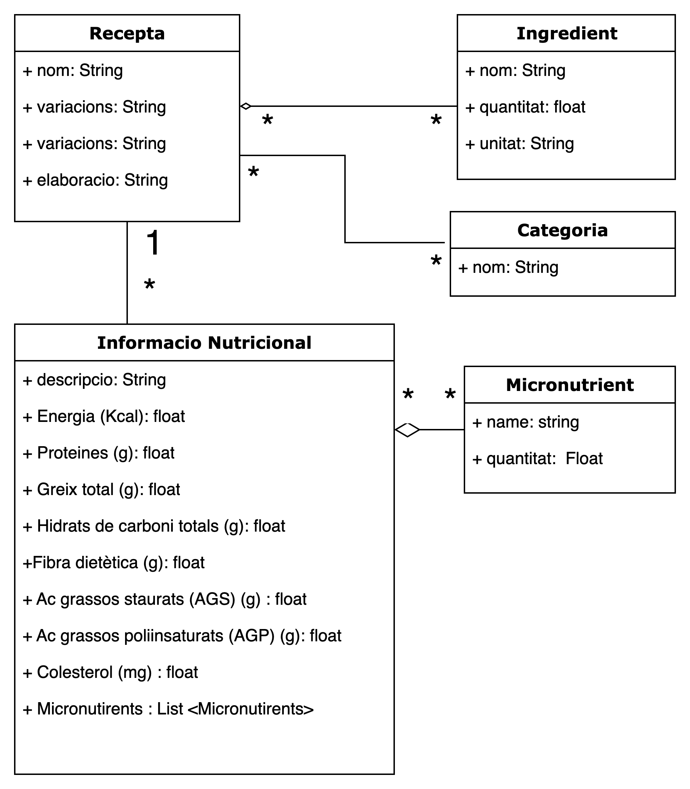

# Pràctica 1: Com podem capturar les dades de la web?
## Notes
vmorantc@uoc.edu
veure repo > https://github.com/jmoreiras-uoc/tcvd-formato-practica1
## Versions
Versió|Data|Descripció dels canvis
-|-|-
V0|27/10/24|Creació del repositori i preparació de la documentació.

## Descripció

Aquest repositori conté la documentació per a la *Pràctica 1* de l'assignatura *Tipologia i cicle de vida de les dades* amb codi *M2.951* del *Màster en Ciència de Dades* de la Universitat Oberta de Catalunya (UOC).

En aquesta pràctica s'identifiquen i extreuen dades rellevants per a un projecte analític mitjançant eines específiques de *web scraping*.

## Membres del grup

L'activitat ha estat realitzada per:
[Arnau Biosca Romanillos, PhD](https://www.linkedin.com/in/naubiosca/) i 
[Eduard Ferrer Font](https://www.linkedin.com/in/eduard-ferrer-font/)

## Context
Amb l'objectiu de promoure una millor salut a través de l'alimentació, així com de promoure i explorar la cultura culinaria catalana, la Fundació Institut Català de la Cuina i de la Cultura Gastromòmica està realitzant, en col·laboració amb la UOC, un estudi sobre el varlor energètic i nutricional dels plats que conformen el receptari culinari català.
En aquest context, el següent programa busca crear un repositori amb les dades obtingudes d'aquest estudi per a tal de poder fer-ne un posterior anàlisis.

URL: https://www.cuinacatalana.eu/ca/pag/receptes/

## Títol
Web scraping per a la cerca de receptes de cuina catalana.

## Descripció del dataset
Per aquesta pràctica hem decidit desenvolupar una eina per a extreure informació rellevant de receptes de cuina catalana, fent servir com a font la web de la Fundació Institut Català de la Cuina i de la Cultura Gastronòmica.
El dataset està composat per aproximadament 900 receptes de cuina, de les quals es disposa el nom, els ingredients, el procés d'elaboració, una categoria i, en determinats casos, el seu valor nutricional, així com variacions.

Els objectius de la solució són:
- Extreure les dades de les receptes de cuina de pàgines webs rellevants (versió 1)
- Disposar de les dade sen format estandaritzat i ordenat per a la seva posterior explitació.
- Realitzar estudis sobre les dades obtingudes. Alguns casos d'us pot ser la recerca de noves receptes, la recuperació de receptes en desús o la optimització de dietes, l'estudi de l'alimentació catalana. (versió 2)

## Representació gràfica



## Contingut
El dataset esà composat per un llistat de receptes. Cada recepta té els atributs "títol", "secció" (categoria), "Ingredients" (llistat d'ingredients), "Instruction" (descripció del procés d'elaboració), "Variations" (variacions de la recepta original i "Nutrition Informatio" (informació nutricional).)
## Propietari
El propierati del conjunt de dades és la Fundació Institut Català de la Cuina i de la Cultura Gasdtronòmica. Anteriorment s'han realitzat estudis i publicacions amb algunes de les dades del dataset. Destaquem les publicacions presents a https://www.uoc.edu/opencms_portal2/opencms/CA/unesco-chair-food-culture-development/publications/list.html.
Per altra banda, estudis similars al proposat en aquesta pràctica, han permés la creació de datasets de receptes per facilitar la recerca de l'espai culinari (receptes, ingredients, processos de cocció, tècniques, patrons d'alimentació) i associacions amb els sabors i la salud: https://pubmed.ncbi.nlm.nih.gov/33238002/
Per a determinar els requeriments legals de les dades utilitzades s'ha consultat l'arxiu robots.txt així com l'Avís Legal de la pàgina web. No s'hi ha trobar cap limitaicó en l'explotació de les dades.
## Inspiració
Aquest conjunt de dades preten servir de base de coneixement per a la creació d'enies que permetin la creació de receptes noves, la recomanació de receptes segons, trobar relacions entre patrons alimentaris i salud. Un cas d'éxit similar és el de l'estudi realitzat per Batra et al,en el que creen un dataset de 118171 receptes de tot el món amb objectius similars.
## Llicència

*** 


Seleccionar una d'aquestes llicències pel dataset resultant i justificar el motiu de la seva selecció. Exemples de llicències que poden considerar-se:
- Released Under CC0: Public Domain License.
- Released Under CC BY-NC-SA 4.0 License.
- Released Under CC BY-SA 4.0 License.
- Database released under Open Database License, individual contents under Database Contents License.
- Altres (especificar quina).

## Codi
Codi implementat per a l’obtenció del dataset, preferiblement en Python o, alternativament, en R.
- El codi haurà de situar-se a la carpeta /source del repositori.
- S'han d'indicar les llibreries i versions utilitzades. P. ex., en Python poden obtenir-se mitjançant la comanda pip3 freeze > requirements.txt
- Al document PDF s'han de comentar els aspectes més rellevants sobre com el codi realitza el procés de  recol·lecció de dades, quines dificultats presenta el lloc web triat, i com les heu resolt.

## Dataset
Publicar el dataset obtingut en format CSV a Zenodo, incloent-hi una breu descripció del mateix. Obtenir i adjuntar l'enllaç del DOI del dataset (https://doi.org/...). El dataset també haurà d’incloure’s a la carpeta /dataset del repositori. Si existeix qualsevol circumstància que impedeixi publicar obertament el dataset real a Zenodo, s’haurà de:
a. Comentar aquesta circumstància i justificar el motiu.
b. Generar un dataset simulat i publicar-lo a Zenodo, obtenint l'enllaç del DOI.
c. Comunicar al professor el dataset real de manera privada (p. ex., al repositori privat o a una carpeta de Google Drive privada).

## Vídeo
Realitzar un breu vídeo explicatiu de la pràctica (màxim 10 minuts), que haurà de comptar amb la participació dels dos integrants del grup. Al vídeo s'haurà de realitzar una presentació del projecte, destacant els punts més rellevants, tant de les respostes als apartats com del codi utilitzat per a extreure les dades. Indicar l'enllaç del vídeo (https://drive.google.com/...), que haurà d’estar al Google Drive de la UOC

```markdown
## Ficheros del código fuente

* **src/main.py**: punto de entrada al programa. Inicia el proceso de scraping.
* **src/scraper.py**: contiene la implementación de la clase _AccidentsScraper_ cuyos métodos generan el conjunto de datos a partir de la base de datos online [PlaneCrashInfo](http://www.planecrashinfo.com/database.htm).
* **src/reason_classifier.py**: contiene la implementación de la clase que se encarga de asignar una causa a un resumen de accidente dado. Para ello, utiliza la librería *TextBlob*.
```
## Recursos
1. Subirats, L., Calvo, M. (2018). Web Scraping. Editorial UOC.
2. Masip, D. El lenguaje Python. Editorial UOC.
3. Lawson, R. (2015). Web Scraping with Python. Packt Publishing Ltd. Chapter 2. Scraping the Data.
4. Simon Munzert, Christian Rubba, Peter Meißner, Dominic Nyhuis. (2015). Automated Data Collection with R: A Practical Guide to Web Scraping and Text Mining. John Wiley & Sons.
5. freeCodeCamp. (2024). *How to Create and Sync Git and GitHub Repositories*. https://www.freecodecamp.org/news/create-and-sync-git-and-github-repositories/
6. La crisis de la vivienda (OCT 2024). Barcelona Metròpolis. https://www.barcelona.cat/metropolis/es/contenidos/la-crisis-de-la-vivienda
7. Devansh B. et al. RecipeDB: a resource for exploring recipes, Database, Volume 2020, 2020, baaa077, https://doi.org/10.1093/database/baaa077. 
8. https://www.uoc.edu/opencms_portal2/opencms/CA/unesco-chair-food-culture-development/publications/list.html
